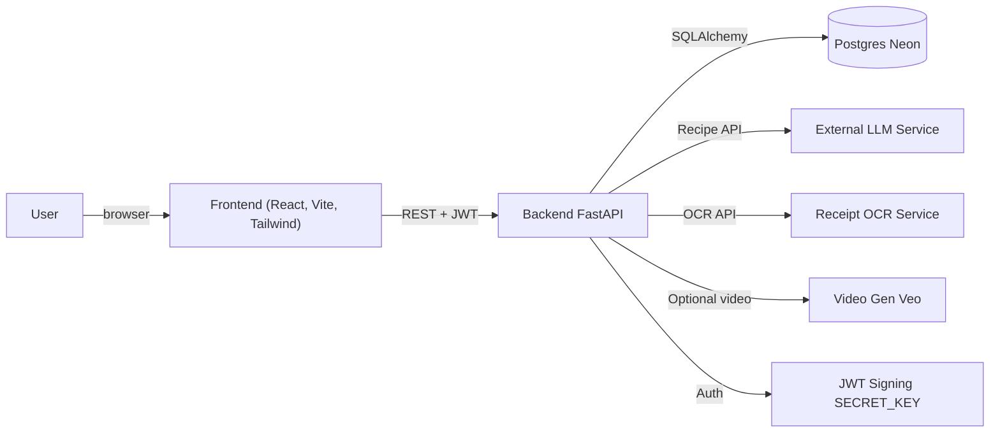
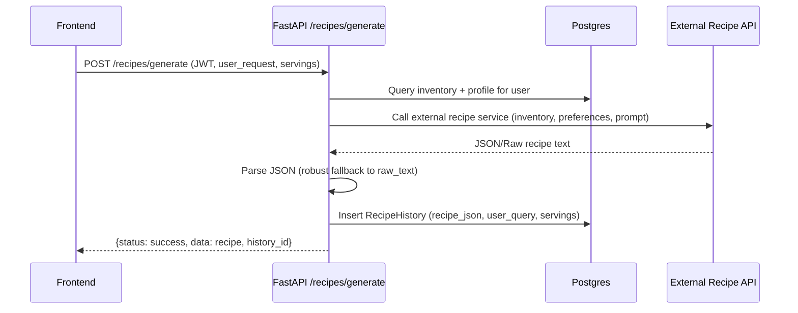
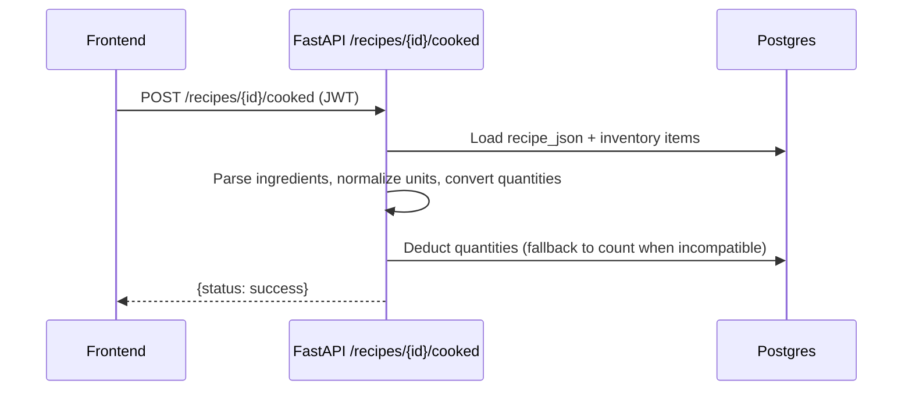
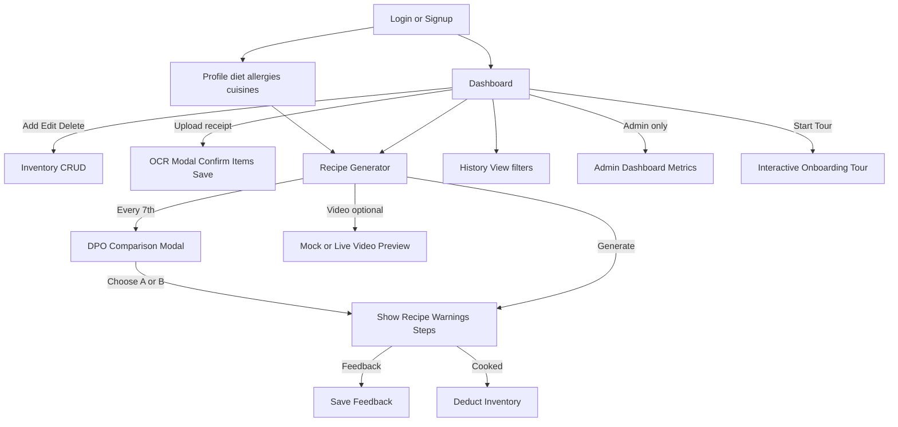

# 🍳 PantryPilot – Model Deployment (Web App)

Full-stack web application for PantryPilot, covering auth, profiles, inventory management, OCR receipt ingest, recipe generation, history, cooked deduction, feedback, and optional video generation. Frontend is React/Vite; backend is FastAPI + SQLAlchemy with Postgres (Neon). Deployed on Render as two services (backend Web Service, frontend Static Site). This document is intentionally detailed so a new engineer can deploy, extend, or debug without tribal knowledge.

---

## System Architecture



### Request Lifecycle (happy path)

1) User authenticates (register/login) → JWT issued and stored client-side.  
2) Inventory/Profiles fetched via authenticated calls.  
3) Recipe generate: frontend posts prompt → backend pulls inventory + profile → calls external model → saves JSON to history → returns recipe.  
4) Cooked: user marks cooked → backend parses ingredients, matches inventory, converts units, deducts quantities.  
5) OCR: user uploads receipt → backend sends to external OCR → user confirms detected items → inserts into inventory.  
6) Video (optional): frontend triggers `/recipes/video` → mock URL unless Veo enabled.

### Backend request flow (recipe generation)



### Backend request flow (cooked deduction)



---

## Components & Technologies

- Frontend: React 19, Vite, Tailwind CSS, framer-motion, axios, **react-joyride** (interactive tour). Auth via JWT stored locally; API base set by `VITE_API_BASE_URL`. Animations for loading/UX polish.
- Backend: FastAPI, SQLAlchemy, Postgres, passlib + jose (JWT), Pillow (image handling), requests. External calls: recipe model API (Cloud Run), OCR API, optional Veo video gen. CORS configurable via env. **Strict dietary restriction enforcement** in prompts.
- Data: Postgres tables for users, profiles, inventory, recipe history, **recipe preferences (DPO comparisons)**.

---

## Repository Layout (model_deployment/)

```
model_deployment/
  backend/
    main.py                 # FastAPI app, CORS, startup/shutdown
    routers/                # auth, users, inventory, recipes, admin
      auth.py               # register/login (JWT)
      users.py              # profile CRUD
      inventory.py          # inventory CRUD + OCR upload/confirm
      recipes.py            # recipe gen, cooked, feedback, history, video, DPO comparison
      admin.py              # admin dashboard metrics (users, recipes, inventory stats)
    model_service.py        # external recipe API client (LLM) with strict dietary enforcement
    utils/smart_inventory.py# ingredient parsing, normalization, unit conversion, fuzzy match
    models.py               # SQLAlchemy models (User, UserProfile, InventoryItem, RecipeHistory, RecipePreference)
    database.py             # SessionLocal engine
    requirements.txt
    .env.example            # suggested env layout (not committed with secrets)
  frontend/
    public/logo.png         # favicon/logo
    src/api/axios.js        # axios instance, baseURL from VITE_API_BASE_URL
    src/pages/              # Dashboard, RecipeGenerator, Profile, History, Login, Signup, AdminDashboard
    src/components/         # Layout, AppTour, Toast, Skeleton, shared UI
      AppTour.jsx           # Interactive onboarding tour (react-joyride)
      AppTour.css           # Tour styling (glassmorphism theme)
    index.html              # head, favicon, title
    package.json
```

---

## Data Model (backend/models.py)

- User: id, username, email, hashed_password, created_at
- UserProfile: dietary_restrictions[], allergies[], favorite_cuisines[], recipe_generation_count
- InventoryItem: item_name, quantity, unit, expiry_date?, category, user_id, created_at
- RecipeHistory: recipe_json (generated), user_query, servings, feedback_score, is_cooked, created_at, user_id
- **RecipePreference**: variant_a, variant_b, chosen_variant, rejected_variant, skipped, prompt, generation_number (DPO comparison data)

---

## API Surface (key routes)

Auth
- `POST /auth/register` → {access_token, token_type}
- `POST /auth/token` → {access_token, token_type}

User profile
- `GET /users/profile` → username, email, dietary_restrictions, allergies, favorite_cuisines
- `PUT /users/profile` → update lists

Inventory
- `GET /inventory/` → list items (auth required)
- `POST /inventory/` → create item
- `PUT /inventory/{id}` → update item
- `DELETE /inventory/{id}` → delete item
- `POST /inventory/upload` → upload receipt (multipart), forwards to external OCR, returns detected items
- `POST /inventory/confirm_upload` → bulk insert confirmed OCR items

Recipes
- `POST /recipes/generate` → calls external recipe API (LLM) with **strict dietary restrictions**, saves history, returns recipe payload. Every 7th generation triggers DPO comparison mode.
- `POST /recipes/{id}/cooked` → deducts inventory using smart_inventory parsing/conversion
- `POST /recipes/{id}/feedback` → save feedback score
- `GET /recipes/history` → newest-first recipe history
- `POST /recipes/video` → mock video URL by default; when `VIDEO_GEN_ENABLED` and Veo key present, attempts live video gen
- `POST /recipes/warmup` → lightweight endpoint to warm up external LLM service (called on login)

DPO Comparison (Direct Preference Optimization)
- `POST /recipes/preference/{id}/choose` → user selects variant A or B, saves to history
- `POST /recipes/preference/{id}/skip` → user skips comparison

Admin (requires admin user)
- `GET /admin/metrics` → user count, recipe count, inventory stats, feedback distribution
- `GET /admin/users` → list all users with profile data
- `GET /admin/recipes` → list all recipes with user info
- `POST /admin/seed` → create admin user (one-time setup)

Training / Retraining Alerts
- `GET /training/pending` → list users with 50+ preferences (admin only)
- `POST /training/approve/{user_id}` → approve retraining for a user
- `GET /training/export/{user_id}` → export user preferences in DPO format (admin only)
- **Slack Alerts**: When a user reaches 50 preference choices, a Slack notification is sent automatically (requires `SLACK_WEBHOOK_URL` env var)

---

## Smart Inventory Logic (utils/smart_inventory.py)

- Parsing: regex to extract qty/unit/name (handles decimals and fractions, prefix and parenthetical patterns).
- Unit normalization: maps plurals/variants to canonical units (lb/kg/g/oz, cup/tbsp/tsp/ml/l, pcs, can, bunch, head, clove).
- Unit conversion: weight and volume conversions; fallback to count when incompatible units.
- Fuzzy matching: similarity + token overlap to match recipe ingredient names to inventory items.
- Deduction: when cooked, attempts conversion and multiplies by servings; falls back to simple count when units incompatible.

---

## External Integrations

- Recipe generation: external API at Cloud Run (see `model_service.py`) returning JSON; robust parsing on frontend/backend to handle raw text or JSON.
- OCR: external OCR endpoint; response normalized, user confirms before insert.
- Video (optional): `/recipes/video` returns mock URL unless `VIDEO_GEN_ENABLED=true` and `VIDEO_GEN_API_KEY` set; uses google-genai client when enabled.

---

## Environment Variables

Backend (required unless noted)
- `DATABASE_URL` (Postgres/Neon) — required
- `SECRET_KEY` — required (JWT signing)
- `FRONTEND_ORIGIN` — optional; add prod frontend origin to CORS (localhost defaults always allowed)
- `VIDEO_GEN_ENABLED` — optional, default false
- `VIDEO_GEN_API_KEY`, `VIDEO_GEN_MODEL`, `VIDEO_GEN_TIMEOUT`, `VIDEO_GEN_POLL_SECONDS` — optional, for live video gen
- (If your recipe/OCR endpoints need keys, set them here; current endpoints are open)

Frontend
- `VITE_API_BASE_URL` — required in prod (backend URL)

---

## Local Development

Backend

```bash
cd model_deployment/backend
python -m venv .venv && source .venv/bin/activate
pip install -r requirements.txt
export DATABASE_URL=sqlite:///./pantry.db   # for local only; use Postgres in prod
export SECRET_KEY=devsecret
uvicorn main:app --reload --host 0.0.0.0 --port 8000
```

Frontend

```bash
cd model_deployment/frontend
npm install
VITE_API_BASE_URL=http://localhost:8000 npm run dev
```

Smoke checks (manual)
- Register/login, confirm token stored and profile fetch works.
- Inventory CRUD.
- Recipe generate returns JSON; history shows entries.
- Mark cooked deducts inventory (watch quantities drop, with fallback when units mismatch).
- OCR upload returns detected items; confirm upload inserts items.
- Video button returns mock video preview (unless live enabled).

---

## Deployment (Render reference)

Backend (Web Service)
- Root: `model_deployment/backend`
- Build: `pip install -r requirements.txt`
- Start: `uvicorn main:app --host 0.0.0.0 --port $PORT`
- Env: `DATABASE_URL`, `SECRET_KEY`, `FRONTEND_ORIGIN=https://<frontend>`, `VIDEO_GEN_ENABLED=false` (keep off unless using Veo)
- Python: set `PYTHON_VERSION=3.11.9`

Frontend (Static Site)
- Root: `model_deployment/frontend`
- Build: `npm install && npm run build`
- Publish dir: `dist`
- Env: `VITE_API_BASE_URL=https://<backend>`

Branch selection: Render lets you pick a branch per service; set it in service settings. Redeploy after env/branch changes.

---

## UX Walkthrough (frontend)

- Login/Signup pages: JWT auth flow.
- Dashboard: inventory grid with edit/delete, low-stock flags, OCR upload modal with confirm-and-edit flow.
- RecipeGenerator: servings selector, prompt input, animated loading, warning banners for missing inventory, parsed steps, feedback buttons, cooked action (inventory deduction), optional video preview widget. **DPO comparison modal** appears every 7th generation.
- History: filter by liked/disliked/neutral, shows user query, timestamps, cooked badge, feedback status.
- Profile: update dietary restrictions (enforced strictly in recipe generation), allergies (comma-separated input), favorite cuisines.
- **Admin Dashboard**: (admin user only) view metrics, user stats, recipe analytics, feedback distribution.
- **Interactive Tour**: Click "Start Tour" in sidebar to get a guided walkthrough of the app's features (powered by react-joyride).

### UI Flow (high level)



---

## Operational Notes & Troubleshooting

- CORS: set `FRONTEND_ORIGIN` on backend; localhost ports (5173, 3000) always allowed.
- Auth: JWT signed with SECRET_KEY; ensure strong value in prod.
- DB: Do not use SQLite in prod; Postgres/Neon only. Ensure `DATABASE_URL` set before start.
- Video: Mock by default; enable only when Veo creds are provided. Fallback to mock on errors to avoid UX breaks.
- OCR: External dependency; if down, upload returns error payload without crashing UI.
- External recipe API: If it times out, backend saves a raw_text error in history; frontend handles gracefully.

---

## Future Extensions (handoff hints)

- Swap model_service to internal model (HF/PEFT) if running locally; keep signature.
- Add rate limiting / request logging middleware.
- Add migrations (Alembic) for schema evolution; currently relies on SQLAlchemy create_all.
- Promote video to first-class (progress polling endpoint, status persistence) if needed.
- Extend DPO data export for model fine-tuning pipeline.
- Add multi-page tour steps if cross-page navigation becomes reliable in react-joyride.
- Consider tour completion persistence (localStorage) to avoid re-showing to returning users.

---

## License

MIT (see repo root).
