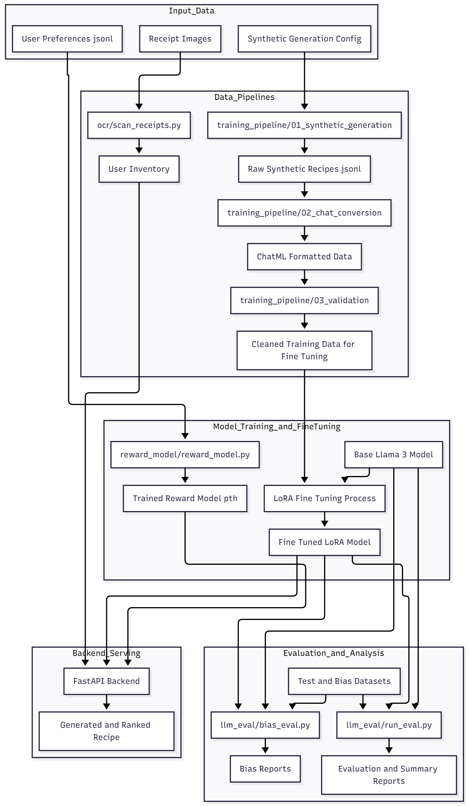

# 🥢 PantryPilot – Data Pipeline & Model Development

**Group 16 · Personalized Grocery Forecasting & Constraint-Aware Recipe Assistant**


[](https://codecov.io/gh/abhikothari091/PantryPilot)


---

## 📘 High-Level Overview

PantryPilot is a personalized grocery management and recipe recommendation system that helps users:

- Maintain and monitor their kitchen inventory
- Plan meals based on available ingredients and preferences
- Avoid ingredient shortages through alerts and smart suggestions

The system is composed of two major technical pillars:

### 1. Data Pipeline (`data_pipeline/`)

- Ingestion from NeonDB (PostgreSQL)
- Validation with Great Expectations
- Transformation & feature engineering
- Monitoring & alerts for low-stock / expiry
- Data versioning with DVC + remote storage (GCS)
- Airflow DAG for orchestration

### 2. Model Development (`model_development/`)

- Synthetic recipe data generation & cleaning (teammate 2, separate training repo)
- LoRA fine-tuning of Llama 3.2 3B Instruct on ~11.8k curated recipes
- Local evaluation & benchmarking of base vs fine-tuned model
- Bias-focused slice evaluation across cuisines & dietary preferences
- Light CI checks that run smoke tests for both the data pipeline and LLM eval

This README describes both the data pipeline and the model development work, plus how they connect conceptually.

---

## 🧱 System Architecture

```
[Synthetic Data Generation for Inventory]
 data_pipeline/data/scripts/synthetic_generate.py
 → Generate diverse pantry items (Western + Non-Western cuisines)
       │
       ▼
Neon Database (PostgreSQL)
├── inventory (from synthetic_data)
├── purchase_history (from synthetic_data)
└── cord_dataset (receipt images metadata)
       │
       ▼
[Data Pipeline]
 data_pipeline/scripts/ingest_neon.py          # Ingestion from NeonDB
 data_pipeline/scripts/validate_data.py        # Great Expectations validation
 data_pipeline/scripts/transform_data.py       # Pint-based unit normalization
 data_pipeline/scripts/update_anomalies.py     # Low stock / expiry alerts
 DVC + Airflow orchestration
       │
       ▼
[Cleaned Inventory + History]
 data_pipeline/data/processed/*.csv
       │
       ▼
[Model Development]
 model_development/
  ├── (Teammate 2) Synthetic recipe generation + LoRA fine-tuning
  ├── (External) FastAPI + React app for recipe serving
  └── llm_eval/ (this project)
        ├── run_eval.py        # Base vs LoRA evaluation
        ├── metrics.py         # Parsing and metric computation
        ├── datasets.py        # Test data loader
        ├── bias_eval.py       # Bias slice evaluation
        └── reports/           # CSV/JSON outputs
```

In a fully integrated version of PantryPilot, the data pipeline outputs (clean inventory and history) would feed into the model inference layer to drive personalized recipe generation and inventory-aware suggestions.



---

## 🧉 Data Pipeline Components

### 0. Synthetic Inventory & Purchase Data

- **Script:** `data_pipeline/data/scripts/synthetic_generate.py`
- **Goal:** Generate realistic, diverse grocery data for development & testing.

**Key Features:**

- **Bias mitigation:** includes both Western and Non-Western food items
  - e.g. rice, kimchi, tofu, soy sauce, ginger, Indian spices, etc.
- **Realistic attributes:**
  - Category (produce, dairy, pantry, etc.)
  - Expiry dates
  - Storage type (fridge, freezer, pantry)
  - Nutritional tags
  - Purchase patterns per user
- **Configurable scale (current runs):**
  - ~20 users
  - ~50–60 items per user
  - ~300 purchases per user

**Outputs:**

- `data_pipeline/data/synthetic_data/pantrypilot_inventory_u20_i60_shared_ids.csv`
- `data_pipeline/data/synthetic_data/pantrypilot_purchase_u20_i60_shared_ids.csv`

These synthetic CSVs are uploaded to NeonDB, where they appear as `inventory` and `purchase_history` tables used by the pipeline.

---

### 1. Ingestion Layer

- **Script:** `data_pipeline/scripts/ingest_neon.py`
- **Goal:** Extract structured data from NeonDB and store as CSV snapshots under `data_pipeline/data/raw/`.

**Datasets:**

- `inventory.csv` (synthetic inventory in NeonDB)
- `purchase_history.csv` (synthetic purchase history in NeonDB)
- `cord_dataset.csv` (receipt images metadata, for future OCR / VLM integration)

**Output Path:**

- `data_pipeline/data/raw/`

`ingest_neon.py` connects via SQLAlchemy using `DB_URL` from `scripts/config.py`, runs `SELECT *` on each table, and writes the results as CSV snapshots.

---

### 2. Validation Layer (Great Expectations)

- **Script:** `data_pipeline/scripts/validate_data.py`
- **Framework:** Great Expectations

**Purpose:**

- Validate schema and column types
- Check for nulls and invalid values
- Enforce logical rules (e.g., non-negative quantities)
- Generate interactive HTML quality reports

**Outputs:**

- HTML docs: `data_pipeline/great_expectations/uncommitted/data_docs/local_site/index.html`
- Summary CSV: `data_pipeline/reports/validation_summary.csv`

**Example Outcome:**

```
[VALIDATION] inventory.csv        → PASS ✅
[VALIDATION] purchase_history.csv → FAIL ❌ (intentional data issue for demo)
```

Intentional failures are left to demonstrate how the pipeline surfaces data quality problems.

---

### 3. Transformation Layer

- **Scripts:**
  - `data_pipeline/scripts/transform_data.py`
  - `data_pipeline/scripts/utils_pint.py`

**Goal:** Normalize all quantities and engineer useful features.

**Key Steps (Inventory):**

- Normalize units to canonical form (g, ml, pcs) using Pint via `utils_pint.to_canonical`.
- Compute `stock_value = qty_canonical × unit_cost`.
- Compute `is_low_stock` flag based on `reorder_threshold`.
- Write cleaned inventory to `data_pipeline/data/processed/inventory_cleaned.csv`.

**Key Steps (Purchase History):**

- Compute `unit_price = price_total / quantity_purchased` (safe division to avoid zero-division issues).
- Write cleaned purchase history to `data_pipeline/data/processed/purchase_history_cleaned.csv`.

---

### 4. Monitoring & Alerts

- **Script:** `data_pipeline/scripts/update_anomalies.py`
- **Goal:** Identify low-stock or expired items and log them as alerts.

**Output:** `data_pipeline/data/alerts/alerts.csv`

**Example schema:**

| item_name | issue_type | quantity | expiry_date |
| --------- | ---------- | -------- | ----------- |
| Milk      | Expired    | 1        | 2025-09-15  |
| Rice      | Low Stock  | 0.45 kg  | —          |

These alerts can later be wired into a UI or notification system.

---

### 5. Versioning & Reproducibility (DVC + GCS)

- **Tools:** Git + DVC + Google Cloud Storage

**Tracked folders:**

- `data_pipeline/data/raw/`
- `data_pipeline/data/processed/`
- `data_pipeline/data/alerts/`

**Example workflow:**

```bash
cd data_pipeline

# Initialize DVC
dvc init

# Configure remote
dvc remote add -d myremote gs://pantrypilot-dvc-storage/data

# Track local data
dvc add data/raw data/processed data/alerts

# Push to remote
dvc push

# Commit metadata
git add data/*.dvc .dvc .dvcignore
git commit -m "Track datasets with DVC and GCS remote"
```

**Verification commands:**

```bash
dvc status   # Check if local and remote are in sync
dvc pull     # Download from GCS if needed
```

This ensures that every pipeline run is reproducible with a specific version of the raw/processed/alerts data.

---

### 6. Orchestration with Airflow

- **DAG file:** `data_pipeline/airflow/dags/pantry_pilot_dag.py`

**Pipeline flow:**

```
ingest_neon → validate_data → transform_data → detect_anomalies → dvc_status
```

**DAG configuration:**

- **DAG ID:** `pantrypilot_data_pipeline`
- **Schedule:** currently manual; can be set to `"0 6 * * *"` for daily 6 AM runs
- **Tasks:**
  1. `ingest_neon` – Extract from NeonDB
  2. `validate_data` – Run Great Expectations
  3. `transform_data` – Perform unit conversions & feature engineering
  4. `detect_anomalies` – Generate alerts
  5. `dvc_status` – Check DVC sync state

**Example test run:**

```bash
export AIRFLOW_HOME=$(pwd)/airflow
airflow db migrate

# Dry-run the full DAG for a specific date
airflow dags test pantrypilot_data_pipeline 2025-01-01
```

---

## 🧮 Project Folder Structure (Updated)

```
PantryPilot/
├── data_pipeline/                      # Main data pipeline
│   ├── airflow/dags/pantry_pilot_dag.py
│   ├── data/
│   │   ├── alerts/
│   │   ├── processed/
│   │   ├── raw/
│   │   ├── receipts/
│   │   ├── scripts/synthetic_generate.py
│   │   └── synthetic_data/
│   ├── great_expectations/
│   ├── reports/
│   ├── screenshots/
│   ├── scripts/
│   │   ├── bias_check.py
│   │   ├── config.py
│   │   ├── ingest_neon.py
│   │   ├── logging_conf.py
│   │   ├── profile_stats.py
│   │   ├── transform_data.py
│   │   ├── update_anomalies.py
│   │   ├── utils_pint.py
│   │   └── validate_data.py
│   ├── tests/
│   ├── requirements.txt
│   └── dvc.yaml
│
├── model_deployment/                   # Web app (frontend + backend)
│   ├── README.md                       # Detailed deployment guide
│   ├── backend/
│   │   ├── auth_utils.py
│   │   ├── database.py
│   │   ├── main.py
│   │   ├── model_service.py            # External LLM API client (strict dietary enforcement)
│   │   ├── models.py                   # User, UserProfile, InventoryItem, RecipeHistory, RecipePreference
│   │   ├── requirements.txt
│   │   ├── routers/
│   │   │   ├── auth.py
│   │   │   ├── inventory.py
│   │   │   ├── recipes.py              # Recipe gen, DPO comparison, feedback, history
│   │   │   ├── users.py
│   │   │   └── admin.py                # Admin dashboard metrics
│   │   └── utils/smart_inventory.py
│   ├── frontend/
│   │   ├── public/logo.png             # Favicon/logo
│   │   ├── index.html                  # Uses logo.png + title
│   │   ├── package.json
│   │   └── src/
│   │       ├── api/axios.js
│   │       ├── assets/
│   │       ├── components/
│   │       │   ├── Layout.jsx          # Main layout with sidebar
│   │       │   ├── AppTour.jsx         # Interactive onboarding tour (react-joyride)
│   │       │   ├── AppTour.css         # Tour styling (glassmorphism)
│   │       │   ├── Toast.jsx           # Toast notifications
│   │       │   └── Skeleton.jsx        # Loading skeletons
│   │       ├── context/
│   │       ├── pages/                  # Dashboard, RecipeGenerator, Profile, History, Login, Signup, AdminDashboard
│   │       ├── App.jsx
│   │       ├── main.jsx
│   │       ├── App.css
│   │       └── index.css
│   └── model_weights/                  # LoRA adapters (if used locally)
│
├── model_development/                  # Model development & eval
│   ├── training_pipeline/
│   │   ├── 01_synthetic_generation/
│   │   │   ├── generate_synthetic_recipes_groq.py
│   │   │   ├── SCENARIOS.md
│   │   │   └── README.md
│   │   ├── 02_chat_conversion/
│   │   │   ├── convert_to_chat_format.py
│   │   │   └── README.md
│   │   ├── 03_validation/
│   │   │   ├── validate_dietary_constraints.py
│   │   │   ├── clean_training_data.py
│   │   │   └── README.md
│   │   ├── 04_training/
│   │   │   ├── lambda_finetune_llama3b.ipynb
│   │   │   ├── lora_config_v3.yaml
│   │   │   └── LAMBDA_LABS_SETUP_GUIDE.md
│   │   └── data/ (synthetic/chat_format/cleaned)
│   ├── llm_eval/
│   │   ├── config.py, datasets.py, metrics.py, run_eval.py, bias_eval.py, analyze_results.py
│   │   ├── data/ (recipes_test.jsonl, val_bias.json)
│   │   └── reports/ (eval_*.json, eval_summary_*.csv, bias_report.csv)
│   ├── models/ (gitignored; LoRA adapters)
│   └── ocr/ (scan_receipts.py, ocr_evaluation.ipynb, test_receipts/)
│
├── DataCard/                           # Data & model documentation
├── docs/                               # Slides/notes
├── .github/workflows/pantrypilot_ci.yml# CI
├── .dvc/                               # DVC config
└── .gitignore                          # Includes model_development/models/
```

Model artifacts under `model_development/models/` are ignored by git to keep the repo lightweight. Instructions for fetching the LoRA adapter and base model are part of the model development section below.

---

## 🧰 Tools & Technologies

| Area               | Tools / Libraries                                  |
| ------------------ | -------------------------------------------------- |
| Database           | NeonDB (PostgreSQL), SQLAlchemy                    |
| Data handling      | pandas                                             |
| Validation         | Great Expectations                                 |
| Units & transforms | Pint                                               |
| Orchestration      | Airflow                                            |
| Versioning         | Git + DVC + GCS remote                             |
| LLM base model     | meta-llama/Llama-3.2-3B-Instruct                   |
| Fine-tuning        | LoRA (PEFT), Lambda Labs GPU (teammate 2)          |
| Inference & eval   | Hugging Face Transformers, PEFT, PyTorch           |
| Frontend / backend | React + FastAPI + MongoDB (external app repo)      |
| CI                 | GitHub Actions (lint, tests, LLM eval smoke tests) |

---

## 🚀 How to Run the Data Pipeline (Local)

### 1. Setup

```bash
# Clone repository
git clone https://github.com/abhikothari091/PantryPilot.git
cd PantryPilot/data_pipeline

# Virtual environment
python -m venv data_pipeline_venv
source data_pipeline_venv/bin/activate  # Windows: data_pipeline_venv\Scripts\activate

# Install dependencies
pip install --upgrade pip
pip install -r requirements.txt
```

Configure database connection:

```bash
cp .env.example .env
# Edit .env and set DATABASE_URL for NeonDB
```

### 2. Manual step-by-step run

```bash
# 1. Ingest
python -m scripts.ingest_neon

# 2. Validate
python -m scripts.validate_data

# 3. Transform
python -m scripts.transform_data

# 4. Alerts
python -m scripts.update_anomalies

# 5. Optional profiling
python -m scripts.bias_check
python -m scripts.profile_stats

# 6. Tests
pytest -q tests
```

**Outputs to verify:**

- `data/raw/*.csv` → raw snapshots
- `data/processed/*.csv` → cleaned tables
- `data/alerts/alerts.csv` → anomalies
- `great_expectations/uncommitted/data_docs/local_site/index.html` → validation report
- `reports/validation_summary.csv` → validation summary

### 3. Airflow DAG run

```bash
export AIRFLOW_HOME=$(pwd)/airflow
airflow db migrate

# Test DAG
airflow dags test pantrypilot_data_pipeline 2025-01-01
```

**Expected:**

- All 5 tasks succeed
- Same artifacts as the manual run

---

## 🧠 Model Development: LLM Training & Evaluation

The model development work focuses on recipe generation conditioned on inventory and preferences, with a strong emphasis on:

- JSON schema adherence
- Dietary constraint adherence
- Cuisine matching
- Use of user inventory
- Behavior across dietary & cuisine slices (bias analysis)

### A. Synthetic Recipe Data & LoRA Fine-Tuning (Teammate 2)

The complete training pipeline is available in `model_development/training_pipeline/`.

#### Pipeline Overview

```
01_synthetic_generation/        # Groq API recipe generation (15k recipes)
    ├── generate_synthetic_recipes_groq.py
    ├── SCENARIOS.md               # 6 scenario descriptions
    └── README.md

02_chat_conversion/             # ChatML format conversion
    ├── convert_to_chat_format.py
    └── README.md

03_validation/                  # Dietary constraint validation
    ├── validate_dietary_constraints.py
    ├── clean_training_data.py
    └── README.md

04_training/                    # Lambda Labs LoRA training
    ├── lambda_finetune_llama3b.ipynb
    ├── lora_config_v3.yaml
    └── LAMBDA_LABS_SETUP_GUIDE.md

data/                           # Training data (downloaded from GCS)
    ├── synthetic/              # Raw synthetic recipes
    ├── chat_format/            # ChatML converted
    └── cleaned/                # Final cleaned dataset
```

#### 1. Synthetic recipe generation (Groq + Llama 3.1 8B)

**Script**: `model_development/training_pipeline/01_synthetic_generation/generate_synthetic_recipes_groq.py`

- Use Groq API with Llama 3.1 8B to generate ~15k synthetic recipes
- Cover 6 realistic scenarios (see `SCENARIOS.md`):
  1. Full inventory usage (3,000 recipes)
  2. Inventory + dietary preference (2,400 recipes)
  3. Inventory + cuisine (1,800 recipes)
  4. All constraints combined (1,200 recipes)
  5. Specific ingredients - all available (2,400 recipes)
  6. Specific ingredients - some/all missing (1,200 recipes)
- Force JSON output with fields: recipe name, cuisine, culinary_preference, time, main_ingredients, steps, note, shopping_list
- Parallel processing with rate limiting (30 req/min)

**Run**:

```bash
cd model_development/training_pipeline/01_synthetic_generation
export GROQ_API_KEY="your_groq_api_key"
python generate_synthetic_recipes_groq.py \
  --config config/synthetic_generation.yaml \
  --output data/synthetic/recipes_15k.jsonl
```

#### 2. ChatML conversion & cleaning

**Script**: `model_development/training_pipeline/02_chat_conversion/convert_to_chat_format.py`

- Convert each example into a ChatML-style conversation:
  - `<|im_start|>system` - Recipe generation instructions
  - `<|im_start|>user` - Inventory + preference request
  - `<|im_start|>assistant` - JSON recipe output
- Natural language templates for user requests
- Dietary constraint enforcement in system prompts

**Run**:

```bash
cd model_development/training_pipeline/02_chat_conversion
python convert_to_chat_format.py \
  --input data/synthetic/recipes_15k.jsonl \
  --output data/chat_format/recipes_chat.jsonl
```

#### 3. Validation & cleaning

**Scripts**:

- `model_development/training_pipeline/03_validation/validate_dietary_constraints.py`
- `model_development/training_pipeline/03_validation/clean_training_data.py`
- Validate dietary constraints (vegan, vegetarian, gluten-free, dairy-free)
- Check for violations (e.g., honey in vegan, soy sauce in gluten-free)
- Remove violating recipes (150 out of 12,000 = 1.25%)
- Result: ~11,850 clean training examples

**Run**:

```bash
cd model_development/training_pipeline/03_validation

# Validate
python validate_dietary_constraints.py \
  --input data/chat_format/recipes_chat.jsonl \
  --output validation_reports/violations.json

# Clean
python clean_training_data.py \
  --input data/chat_format/recipes_chat.jsonl \
  --violations validation_reports/violations.json \
  --output data/cleaned/recipes_cleaned.jsonl \
  --strategy remove
```

#### 4. LoRA fine-tuning on Lambda Labs

**Notebook**: `model_development/training_pipeline/04_training/lambda_finetune_llama3b.ipynb`

- **Base model:** meta-llama/Llama-3.2-3B-Instruct (6.4GB)
- **Hardware:** Lambda Labs A100 40GB GPU
- **Method:** LoRA via PEFT
- **Config:**
  - Rank r = 16, alpha = 32
  - Target modules: q_proj, k_proj, v_proj, o_proj
  - 3 epochs, learning rate 2e-4, batch size 8
  - FP16 mixed precision
- **Training time:** 45-60 minutes
- **Cost:** $0.83 - $1.10
- **Output:** LoRA adapter (52MB)

See `model_development/training_pipeline/04_training/LAMBDA_LABS_SETUP_GUIDE.md` for complete setup instructions.

#### 5. DPO Training for Personalized Recipes 🎯

**Directory**: `model_development/training_pipeline/05_dpo_training/`

After SFT training, we use **Direct Preference Optimization (DPO)** to create personalized recipe models for different user personas.

**Key Concepts**:

- **6 Personas**: Korean Spicy, Indian Veg, Italian GF, Japanese Low-Sodium, Mexican Vegan, Chinese Keto
- **Preference Pairs**: Chosen (good) vs Rejected (bad) recipes labeled by Llama 70B
- **DPO Training**: Aligns model outputs with persona-specific preferences
- **Evaluation**: Gemini 2.0 Flash compares DPO vs SFT models

**Pipeline Stages**:

```
1. Variant Generation → 2. Preference Labeling → 3. DPO Training → 4. Evaluation
   (SFT Model)            (Llama 70B via Groq)    (Lambda Labs)     (Vertex AI Gemini)
```

**Stage 1: Generate Variants**

```bash
cd model_development/training_pipeline/05_dpo_training/scripts/
python generate_variants.py --persona persona_a_korean_spicy --count 500
```

- Generates 2 recipe variants per prompt (500 prompts/persona)
- Variant A: Strong persona constraints (temperature=0.7)
- Variant B: Weak/no constraints (temperature=0.9)

**Stage 2: Label Preferences with Llama 70B**

```bash
python groq_choose_preference.py --persona persona_a_korean_spicy
```

- Uses Groq API (FREE) with Llama 3.3 70B as judge
- Labels chosen/rejected based on dietary compliance, cuisine alignment
- Pass rate: ~80-90% (400-450 pairs/persona)

**Stage 3: DPO Training**

```bash
python train_dpo_persona.py --persona persona_a_korean_spicy
```

- Hardware: Lambda Labs A100 40GB
- Cost: ~$0.50-0.80 per persona (~$3-5 total)
- Time: 30-45 min/persona
- Output: LoRA adapters (~173MB each)

**Stage 4: Evaluation**

```bash
cd ../evaluation/
python evaluate_dpo_personas.py --project_id YOUR_GCP_PROJECT_ID --personas all
```

- 120 test cases (20/persona) evaluated by Gemini 2.0 Flash
- Cost: ~$0.06 total
- **Expected Win Rate**: 75.8% (DPO beats SFT)

**Cost Breakdown**:

| Stage               | Service            | Cost            |
| ------------------- | ------------------ | --------------- |
| Variant Generation  | Local GPU          | FREE            |
| Preference Labeling | Groq (Llama 70B)   | FREE            |
| DPO Training        | Lambda Labs A100   | ~$3-5           |
| Evaluation          | Vertex AI (Gemini) | ~$0.06          |
| **Total**     |                    | **~$3-6** |

**Model Storage**:

- **GCS**: `gs://pantrypilot-dpo-models/v1.0/`
- **Local**: `model_development/training_pipeline/05_dpo_training/trained_models/` (gitignored)
- **Download**: `./download_dpo_models.sh`

**Data Versioning**:

- DVC tracks: `data/variants/`, `data/preference_pairs/`, `data/dpo_formatted/`
- Remote: GCS

**Future Enhancements**:

- Automatic retraining based on user feedback threshold
- Real-time user preference collection via API
- A/B testing deployment for model validation

See [model_development/training_pipeline/05_dpo_training/README.md](model_development/training_pipeline/05_dpo_training/README.md) for detailed instructions.

### B. Model Artifacts & Storage

**LoRA Adapter**:

- **Local location (ignored by git):** `model_development/models/llama3b_lambda_lora/`
- **Remote storage (GCS):** `gs://recipegen-llm-models/llama3b_lambda_lora/`
- **Size:** ~52 MB

**Training Data & Pipeline**:

- **Local location (ignored by git):** `model_development/training_pipeline/data/`
- **Remote storage (GCS):** `gs://recipegen-llm-models/data_pipeline/data_pipeline/`
- **Size:** ~45 MB

**Download Instructions:**

```bash
# Authenticate with GCP (if not already authenticated)
gcloud auth login

# Download LoRA model
gcloud storage cp -r gs://recipegen-llm-models/llama3b_lambda_lora ./model_development/models/

# Download training data and pipeline (optional, for reproducibility)
gcloud storage cp -r gs://recipegen-llm-models/data_pipeline/data_pipeline/ ./model_development/training_pipeline/

# Verify downloads
ls -lh model_development/models/llama3b_lambda_lora/
ls -lh model_development/training_pipeline/data/
```

**Important:**

- Ensure `.gitignore` excludes `model_development/models/` so weights are never pushed to git
- No manual extraction needed - model downloads directly to the correct location

The base model (`meta-llama/Llama-3.2-3B-Instruct`) is pulled from Hugging Face at runtime. If it is gated, users must configure `HF_TOKEN` or run `huggingface-cli login`.

---

### C. LLM Evaluation: Base vs LoRA (`llm_eval/`)

All evaluation logic lives in `model_development/llm_eval/`.

#### 1. Config & datasets

- **`config.py`** defines:
  - `PROJECT_ROOT`: repo root as a Path
  - `BASE_MODEL_NAME = "meta-llama/Llama-3.2-3B-Instruct"`
  - `LORA_ADAPTER_DIR`: path to `models/llama3b_lambda_lora/`
  - `MAX_NEW_TOKENS`: generation length cap (e.g., 256)
  - `TEMPERATURE_GRID`: list of temperatures to evaluate (e.g., [0.7])
- **`datasets.py`:**
  - Defines `RecipeTestExample` dataclass:

```python
@dataclass
class RecipeTestExample:
    user_inventory: List[str]
    preference: Optional[str]
    cuisine: Optional[str]
    user_request: Optional[str]
    requested_ingredients: List[str]
    gold_output: Dict[str, Any]
    scenario: str
    generated_at: str
```

- Implements `load_recipes_test()` which reads `recipes_test.jsonl` from the shared recipes folder and constructs `RecipeTestExample` objects.

#### 2. Prompting & generation

`run_eval.py` sets a strict `SYSTEM_PROMPT` for RecipeGen, which instructs the model to:

- Always return exactly one valid JSON object
- Never output markdown, backticks, or extra text
- Follow this schema:

```json
{
  "status": "ok",
  "missing_ingredients": ["..."],
  "recipe": {
    "name": "...",
    "cuisine": "...",
    "culinary_preference": "...",
    "time": "...",
    "main_ingredients": ["..."],
    "steps": "Step 1. ...",
    "note": null
  },
  "shopping_list": ["..."]
}
```

…and follow strict rules like:

- Do not list more than 8 missing_ingredients
- Use inventory as the main source of main_ingredients
- Respect preference (vegan, vegetarian, gluten-free, dairy-free, non-veg, none)
- Match cuisine if provided

ChatML prompt construction is done via `build_chatml_prompt(example)`:

```
<|im_start|>system
...SYSTEM_PROMPT...
<|im_end|>
<|im_start|>user
Inventory: rice, onion, lemon.
Dietary preference: gluten-free.
Cuisine: Chinese.
Request: Quick dinner using mostly my pantry.
<|im_end|>
<|im_start|>assistant
```

`generate_single(...)` then:

- Tokenizes the prompt
- Calls `model.generate(...)` with temperature + MAX_NEW_TOKENS
- Decodes only the assistant continuation and strips anything after `<|im_end|>`

#### 3. Metrics

`metrics.py` defines how outputs are parsed and evaluated.

- **`parse_model_json(raw_text)`:**
  - Extracts the first JSON object from the model's raw string
  - Returns `(parsed_json, is_valid_json)`
- **`compute_example_metrics(example, parsed, valid)`** computes:
  - `json_valid_rate`: 1.0 if valid JSON, else 0.0
  - `diet_match_rate`: 1.0 if output respects the requested dietary preference, else 0.0
  - `constraint_violation_rate`: 1.0 if constraints are violated, else 0.0
  - `cuisine_match_rate`: 1.0 if recipe.cuisine matches requested cuisine (if any)
  - `inventory_coverage`: fraction of main_ingredients that come from user_inventory
- **`aggregate_metrics(list_of_ExampleMetrics)`:**
  - Aggregates all per-example metrics into dataset-level means (e.g., `inventory_coverage_mean`).

#### 4. Running the evaluation

From the repo root:

```bash
# Quick sanity check on a tiny subset
python -m model_development.llm_eval.run_eval \
  --max-examples 3 \
  --temperatures 0.7

# Typical benchmark run used in our analysis
python -m model_development.llm_eval.run_eval \
  --max-examples 20 \
  --temperatures 0.7
```

`run_eval.py`:

- Picks device (cuda → mps → cpu), uses float16 on GPU/MPS and float32 on CPU
- Loads tokenizer once
- For each model_kind in ["base", "lora"]:
  - Loads base model, or base + LoRA adapter
  - Evaluates for each temperature in TEMPERATURE_GRID
  - Frees memory between models to keep MPS happy
- Writes:
  - `model_development/llm_eval/reports/eval_YYYYMMDD_HHMMSS.json`
  - `model_development/llm_eval/reports/eval_summary_YYYYMMDD_HHMMSS.csv`

**Representative results (20-example run, T = 0.7):**

- **Base model** `base_t0.7`:
  - `json_valid_rate` ≈ 1.00
  - `diet_match_rate` ≈ 0.43
  - `constraint_violation_rate` ≈ 0.57
  - `cuisine_match_rate` ≈ 1.00
  - `inventory_coverage_mean` ≈ 0.70
- **LoRA model** `lora_t0.7`:
  - `json_valid_rate` ≈ 1.00
  - `diet_match_rate` ≈ 0.71
  - `constraint_violation_rate` ≈ 0.29
  - `cuisine_match_rate` ≈ 1.00
  - `inventory_coverage_mean` ≈ 0.67

**Interpretation:**

- Both models reliably produce valid JSON with this prompt structure.
- The LoRA model substantially improves dietary constraint adherence and halves the constraint violation rate.
- Cuisine matching is already strong for both models.
- Inventory coverage stays high for both; small differences are expected due to randomness and synthetic data.

These results are exactly what we want for the final report: a clear, quantitative improvement from fine-tuning.

---

### D. Bias Evaluation

Bias evaluation checks whether performance is consistent across dietary preferences and cuisines.

#### 1. Bias dataset: `val_bias.json`

- **Location:** `model_development/llm_eval/data/val_bias.json` (logically sourced from `data_pipeline/data/recipes/val_bias.json`)
- **Size:** ~29 hand-crafted examples
- **Coverage:**
  - Preferences: vegan, vegetarian, gluten-free, dairy-free, non-veg, none
  - Cuisines: Italian, Chinese, Mexican, Indian, Japanese, Korean, American, Mediterranean, Middle Eastern, Thai, Spanish, etc.
  - Includes tricky cases (e.g., conflicting hints in the request).

Each entry looks like:

```json
{
  "user_inventory": ["tofu", "rice", "broccoli"],
  "preference": "vegan",
  "cuisine": "Chinese",
  "user_request": "Quick weekday dinner using mostly pantry items"
}
```

#### 2. Bias evaluation script: `bias_eval.py`

**Usage:**

```bash
python -m model_development.llm_eval.bias_eval \
  --temperature 0.7 \
  --max-examples 30
```

**What it does:**

- Loads the bias dataset and converts it into `RecipeTestExample` objects (only fields present in the file are used).
- Evaluates both base and lora models on all examples.
- Computes the same metrics as in `metrics.py` for each example.
- Groups results by `(model, preference, cuisine)` and aggregates with `aggregate_metrics`.
- Writes a CSV to:

```
model_development/llm_eval/reports/bias_report.csv
```

**Example CSV snippet (actual run):**

```csv
model,preference,cuisine,n,json_valid_rate,diet_match_rate,constraint_violation_rate,cuisine_match_rate,inventory_coverage_mean
base,vegan,Chinese,1,1.0,1.0,0.0,1.0,0.75
base,gluten-free,Italian,1,0.0,,,,
...
lora,vegan,Chinese,1,1.0,1.0,0.0,1.0,0.5
lora,gluten-free,Italian,1,1.0,1.0,0.0,1.0,1.0
...
```

**Key observations from our run:**

- **JSON validity:** LoRA maintains `json_valid_rate = 1.0` for all slices in this bias set. The base model fails for at least one slice (gluten-free, Italian).
- **Dietary constraints:** The base model shows violations for some vegan / dairy-free / gluten-free slices. LoRA fixes most of these so that `diet_match_rate = 1.0` and `constraint_violation_rate = 0.0` in the same slices.
- **Cuisine & inventory:** `cuisine_match_rate` is consistently 1.0 across slices for both models. `inventory_coverage_mean` is generally high and similar across cuisines and diets, with no obvious pattern of neglect for any specific group.

**Conclusion:** the LoRA-fine-tuned model is:

- More reliable (no JSON failures in the bias set), and
- More faithful to dietary constraints across cuisines.

We also explicitly document remaining edge cases (e.g., occasional difficulty for some dairy-free prompts) as limitations, rather than pretending they don't exist.

---

### E. Results Analysis Helper

`analyze_results.py` is a small helper script that:

- Loads the latest `eval_summary_*.csv` and `bias_report.csv` from the `reports/` folder.
- Prints human-readable comparisons between:
  - Base vs LoRA on the main test eval
  - Base vs LoRA for each (preference, cuisine) slice in the bias eval

**Usage:**

```bash
python -m model_development.llm_eval.analyze_results
```

This is mainly used to copy tables / summaries into the final report and slides.

---

## 🍳 PantryPilot Web Application

Full-stack deployment of PantryPilot (React/Vite frontend + FastAPI backend + Postgres/Neon). Deployed on Render as separate services (backend Web Service, frontend Static Site). Additionally, a specialized `cr_backend` service is deployed to Google Cloud Run, hosting the finetuned LLM for scalable recipe generation. Highlights:

- **Auth + profiles (JWT)**, inventory CRUD with OCR upload/confirmation, recipe generation via external model API, recipe history, "cooked" deduction with unit conversion, optional video generation (mock by default).
- **Admin Dashboard**: View application metrics (user count, recipe stats, inventory analytics, feedback distribution). Admin-only access.
- **Interactive Onboarding Tour**: Built with react-joyride. Users can click "Start Tour" in the sidebar to get a guided walkthrough of app features (Dashboard, Recipes, History, Profile).
- **DPO Comparison Flow**: Every 7th recipe generation shows two variants side-by-side. Users choose A or B, collecting preference data for future model fine-tuning.
- **Slack Retraining Alerts**: When a user reaches 50 preferences, a Slack notification is automatically sent to admins with an "Approve Retraining" button. Requires `SLACK_WEBHOOK_URL` env var.
- **Strict Dietary Restrictions**: Backend enforces dietary preferences (vegetarian, vegan, gluten-free, etc.) with explicit prompts to the LLM. Allergies are marked as "life-threatening" to ensure compliance.
- Configurable CORS via `FRONTEND_ORIGIN`; frontend targets backend via `VITE_API_BASE_URL`.
- Environment vars: `DATABASE_URL`, `SECRET_KEY`, `SLACK_WEBHOOK_URL` (optional), video toggles.
- Deploy steps (Render reference):
  - Backend root `model_deployment/backend`: build `pip install -r requirements.txt`, start `uvicorn main:app --host 0.0.0.0 --port $PORT`, set envs (`DATABASE_URL`, `SECRET_KEY`, `FRONTEND_ORIGIN`, `SLACK_WEBHOOK_URL`, `VIDEO_GEN_ENABLED=false`).
  - Frontend root `model_deployment/frontend`: build `npm install && npm run build`, publish `dist`, env `VITE_API_BASE_URL=https://<backend>`.

### Cloud Run Deployment (Finetuned LLM)

For scalable and efficient inference of the finetuned Large Language Model (LLM), a dedicated service is deployed to Google Cloud Run. This service, found in `model_deployment/cr_backend/`, is optimized for LLM inference, providing quick and cost-effective recipe generation.

- **Purpose**: Hosts the fine-tuned LLM for recipe generation, ensuring high availability and scalability.
- **Technology**: FastAPI application containerized with Docker, deployed on Google Cloud Run.
- Automated Deployment: Deployment to Cloud Run is automated via a GitHub Actions workflow (`.github/workflows/deploy_llm.yml`).
- Details: For comprehensive setup, build, and environment variable configurations, refer to the [model_deployment/README.md](model_deployment/README.md).
- Detailed documentation, flow diagrams, API list, and data model: see [model_deployment/README.md](model_deployment/README.md).

### Cloud Run Video

[Demo Video Link](https://drive.google.com/file/d/1LFeP2v9Wgryn4mrXF7huoIXCo3POPQ5r/view?usp=sharing)

---

## 🔁 CI / Testing

We use a simple GitHub Actions workflow (e.g. `.github/workflows/pantrypilot_ci.yml`) to run basic checks on every push / PR.

**Typical steps:**

1. Set up Python and install dependencies
2. Run data pipeline tests
3. Run LLM eval smoke tests

Conceptually, the workflow does something like:

```bash
# Inside CI job
pip install -r data_pipeline/requirements.txt

# Data pipeline tests
pytest -q data_pipeline/tests

# LLM eval smoke test (small, to keep CI fast)
python -m model_development.llm_eval.run_eval --max-examples 1 --temperatures 0.7
python -m model_development.llm_eval.bias_eval --temperature 0.7 --max-examples 1
```

This ensures that:

- The data pipeline code is runnable and tests pass
- The LLM evaluation stack (imports, config, HF model loading, LoRA loading, metric computation) still works end-to-end on a tiny subset

We treat larger runs (e.g., 20 examples, full bias set) as local experiments, not CI jobs.

---

## 🧠 Reflection & Learnings (End-to-End)

From a full MLOps perspective, this project demonstrates:

### 1. Data-centric pipeline design

- Synthetic data generation to break the "no data" deadlock
- Validation, transformation, and alerting treated as first-class components
- DVC + GCS for reproducible datasets and lineage across team members

### 2. Model development with local + cloud resources

- High-volume synthetic recipe generation using Groq API
- Parameter-efficient fine-tuning (LoRA) of a 3B Llama model
- Clear separation between training repo (LoRA creation) and evaluation/pipeline repo

### 3. Robust evaluation & bias analysis

- Strict JSON schema enforced through prompts and metrics
- Automatic checks for dietary constraint adherence and cuisine correctness
- Custom bias slice evaluation across cuisines and dietary preferences

### 4. Practical deployment readiness

- Local evaluation & inference tested on CPU and Apple M3 Pro (MPS) with careful memory management
- Data pipeline ready to feed downstream services or endpoints
- CI hooks to prevent obvious regressions in both pipeline and model evaluation code

Overall, PantryPilot moves from synthetic inventory data → clean, validated tables → LLM-based recipe generation with measured behavior across multiple user segments. That matches the course goal: not just training a model, but integrating it into a reproducible, observable, and evaluable system.
